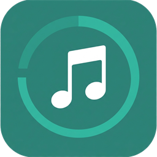
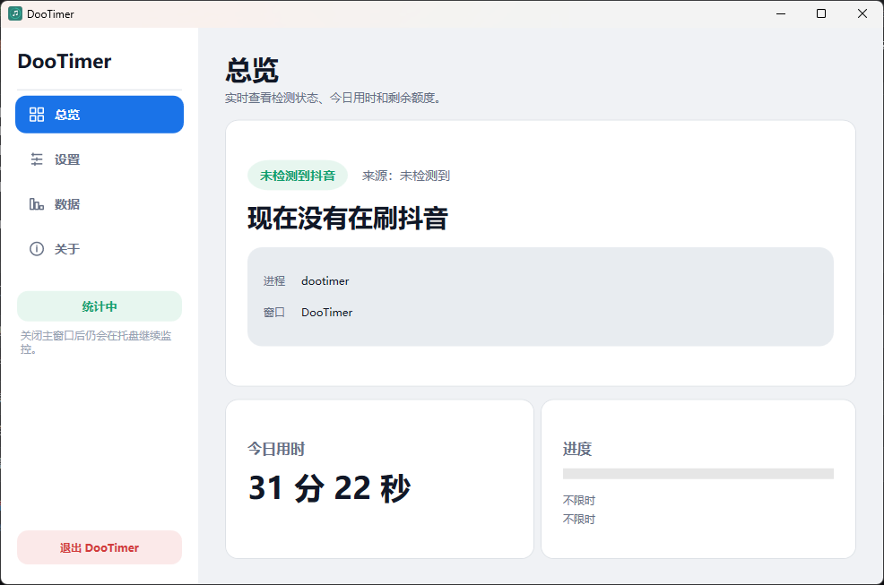
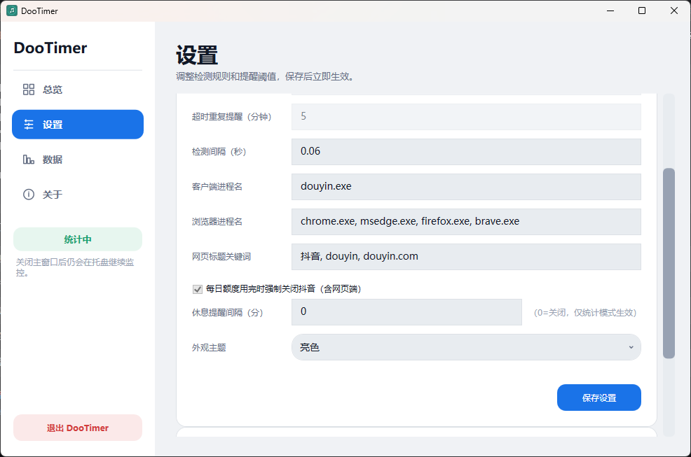
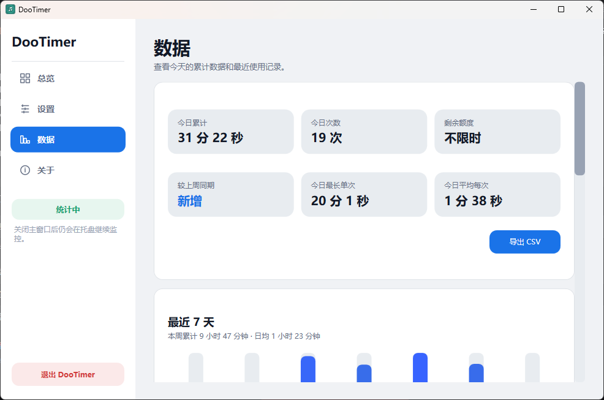
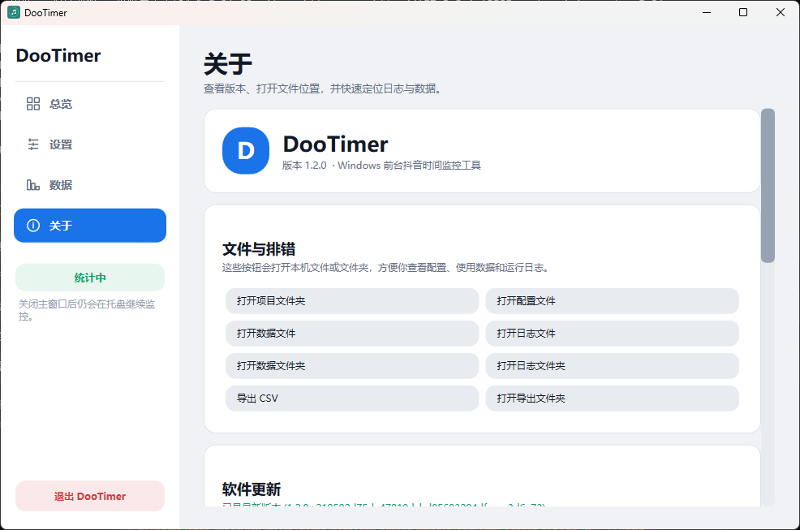
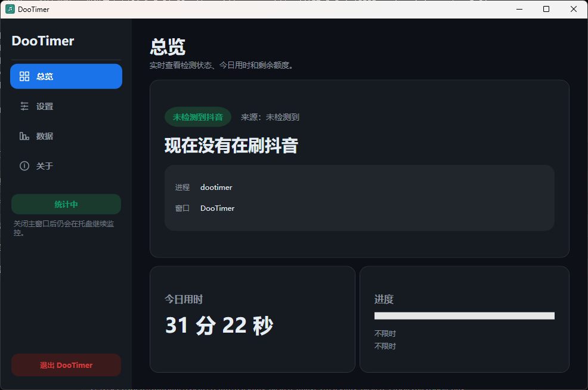

# DooTimer

<p align="center">
  
</p>

<p align="center">
  <strong>Windows 桌面小工具 — 监控你在电脑上刷抖音的时间</strong>
</p>

<p align="center">
  <a href="https://github.com/rlep1016/DooTimer/releases"></a>
  <a href="LICENSE"></a>
  
  
</p>

---

## ✨ 功能

- 🔍 检测抖音客户端和抖音网页（浏览器标题含"抖音"或"douyin.com"）
- ⏱️ 只在抖音处于**前台**时计时
- 🔒 **限制模式**：设每日额度，到 80%/100% 提醒，超时可选强制关闭
- 📊 **统计模式**：只记录不打扰，可开启连续刷屏休息提醒
- 📌 任务栏直接显示计时信息，不占屏幕空间
- 🌗 亮色 / 暗色 / 跟随系统三种主题
- 🔄 启动时自动检查更新，侧边栏红点提示

## 📸 截图

| 总览 | 设置 | 数据 |
|:---:|:---:|:---:|
|  |  |  |

| 关于 & 更新 | 暗色模式 |
|:---:|:---:|
|  |  |

## 📥 安装

从 [Releases](https://github.com/rlep1016/DooTimer/releases) 下载最新安装包：

- **`DooTimer-Setup-vX.X.X.exe`** — 安装向导，可选路径，开始菜单 + 桌面快捷方式

安装后会自动创建开始菜单和卸载入口。后续版本可通过应用内「关于」页一键更新。

## 🛠️ 自己编译

```powershell
git clone https://github.com/rlep1016/DooTimer.git
cd DooTimer
powershell -ExecutionPolicy Bypass -File build.ps1
```

## ⚙️ 配置

所有数据存储在 `%AppData%/DooTimer/`：

| 文件 | 说明 |
|------|------|
| `config.json` | 每日上限、提醒规则、主题、检测进程名等 |
| `data/usage.json` | 每日用时、会话记录 |
| `logs/dootimer.log` | 运行日志 |

## 🧱 技术栈

| 项 | 选型 |
|---|------|
| 语言 | C# (.NET 8) |
| UI | WPF |
| 托盘 | WinForms NotifyIcon |
| 存储 | JSON (System.Text.Json) |
| 安装包 | Inno Setup |
| 外部依赖 | 零个 NuGet 包 |

## 📄 协议

MIT License — [LICENSE](LICENSE)
